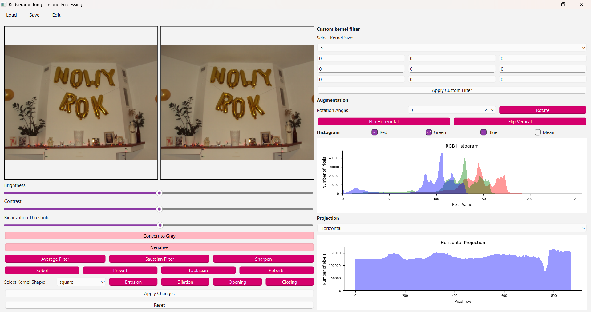

# Biometria - Projekt 1: Analiza i przetwarzanie obrazów
Autorki:
- [Zofia Kamińska](https://github.com/kaminskaz)
- [Karolina Dunal](https://github.com/xxkaro)
  
Celem projektu było zaprojektowanie aplikacji okienkowej umożliwiającej edycję obrazów poprzez operacje na pikselach oraz zastosowanie filtrów graficznych, bez użycia zaawansowanych bibliotek do przetwarzania obrazów, takich jak *OpenCV, PIL (Python Imaging Library)* czy *scikit-image*. 
  
Aplikacja oferuje intuicyjny interfejs z prostymi w obsłudze elementami do pracy z obrazami. Aby uruchomić aplikację należy uruchmić plik *gui_main.py* znajdujący się w folderze [/code](https://github.com/kaminskaz/obrazy/tree/main/code).

Pełna dokumentacja znjaduje się w folderze [/docs](https://github.com/kaminskaz/obrazy/tree/main/docs)
  
Miłego użytkowania!
